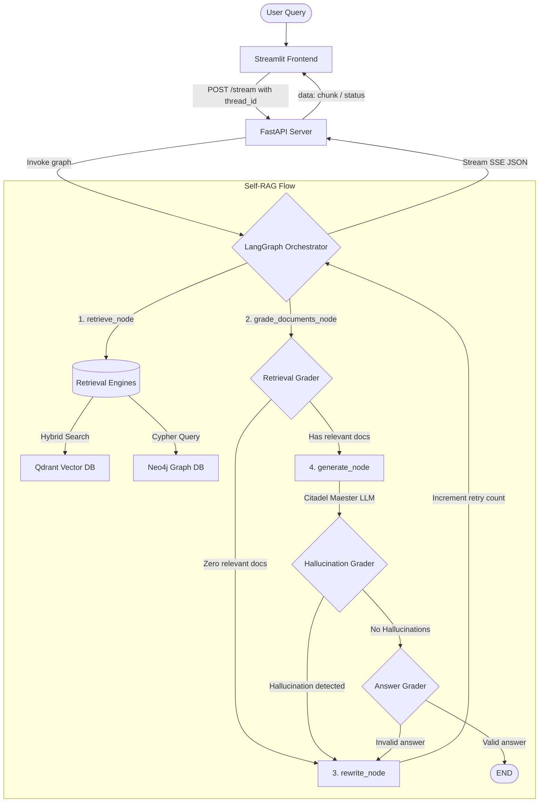

# 📜 Citadel Archival Search: Self-Corrective RAG for "A Song of Ice and Fire"

[](https://fastapi.tiangolo.com/)
[](https://streamlit.io/)
[](https://qdrant.tech/)
[](https://neo4j.com/)
[](https://github.com/langchain-ai/langchain)
[](https://github.com/langchain-ai/langgraph)

An enterprise-grade, asynchronous **Self-Corrective Retrieval-Augmented Generation (Self-RAG)** application for the "A Song of Ice and Fire" (ASOIAF) universe. 

This system moves beyond linear search architectures. It leverages a cyclic agentic state machine to evaluate context relevance, verify factual grounding (detecting and self-correcting hallucinations), rewrite search queries dynamically, and combine structured relationships with unstructured chronicles.

---

## 🛠️ Tech Stack

- **Orchestration**: `LangGraph`, `LangChain` (agent state machine and tool integration)
- **Vector Database**: `Qdrant` (dense-sparse **Hybrid Search** combining Bge-Small-En and Splade embeddings)
- **Graph Database**: `Neo4j` (character relationships and lineage graphs)
- **API Server**: `FastAPI` (Asynchronous, streaming Server-Sent Events)
- **UI Client**: `Streamlit` (Interactive chat history and real-time agent thought logs)
- **Inference Engine**: `Groq` (Llama-3-70b for high-quality citation generation, Llama-3-8b for structured grading/rewriting)
- **Observability**: `LangSmith` (Agent trace monitoring and latency metrics)

---

## 🏛️ System Architecture Flow

The system employs a cyclic state graph that decides when to retrieve, rewrite, or answer based on structured quality metrics:



---

## 🌟 Key Engineering Features

1. **Separation of Concerns**: Frontend and backend are completely decoupled. Streamlit communicates with FastAPI via streaming Server-Sent Events (SSE).
2. **Cyclic Reasoning Loop**: If the document relevance check returns 0 relevant documents, or if the hallucination grader detects unsourced facts, the agent automatically rewrites the query and retries up to 3 times.
3. **Hybrid Search**: Qdrant queries combine dense vector similarity with sparse BM25/Splade keywords, ensuring Westerosi vocabulary (e.g., *Rhaenyra*, *Lightbringer*, *Valyrian*) matches accurately.
4. **Lineage Knowledge Graph**: Neo4j serves character connections asynchronously to resolve queries involving parentage, alliances, and houses.
5. **Thread-Isolated Memory**: Thread IDs are passed inside payloads, enabling LangGraph's local checkpoint memory (`MemorySaver`) to manage user session history seamlessly.

---

## 🚀 Getting Started

### 1. Prerequisites
- Docker & Docker Compose
- Python 3.11+
- Groq API Key
- LangSmith API Key (optional, for observability)

### 2. Environment Configuration
Clone the repository and create a `.env` file in the root directory:
```bash
cp .env.example .env
```
Provide the credentials in `.env`:
```env
PROJECT_NAME="ASOIAF Self-Corrective RAG"
GROQ_API_KEY=your_groq_api_key
QDRANT_URL=http://localhost:6333
QDRANT_API_KEY=your_qdrant_api_key
NEO4J_URI=bolt://localhost:7687
NEO4J_USERNAME=neo4j
NEO4J_PASSWORD=your_neo4j_password
LANGCHAIN_TRACING_V2=true
LANGCHAIN_API_KEY=your_langsmith_api_key
```

### 3. Spin Up Databases using Docker
Start local Qdrant and Neo4j containers:
```bash
docker run -d -p 6333:6333 -p 6334:6334 -v qdrant_storage:/qdrant/storage qdrant/qdrant:latest
docker run -d -p 7474:7474 -p 7687:7687 --name neo4j -v neo4j_storage:/data -e NEO4J_AUTH=neo4j/your_neo4j_password neo4j:latest
```

### 4. Setup Python Environment & Install Dependencies
Create a virtual environment and install packages:
```bash
python -m venv venv
source venv/Scripts/activate  # On Windows: venv\Scripts\activate
pip install -r requirements.txt
```

### 5. Parse Data & Ingest Databases
Run the ETL pipeline to segment the text files, generate hybrid embeddings, build the vector catalog, and seed graph lineages:
```bash
python backend/scripts/run_ingestion.py
```

### 6. Run the FastAPI Server
Launch the backend server using Uvicorn:
```bash
python -m uvicorn backend.app.main:app --host 127.0.0.1 --port 8000 --reload
```

### 7. Run the Streamlit Interface
In a new terminal window, activate the virtual environment and start Streamlit:
```bash
python -m streamlit run frontend/app.py
```
Open your browser to `http://localhost:8501` to query the Citadel archives.
