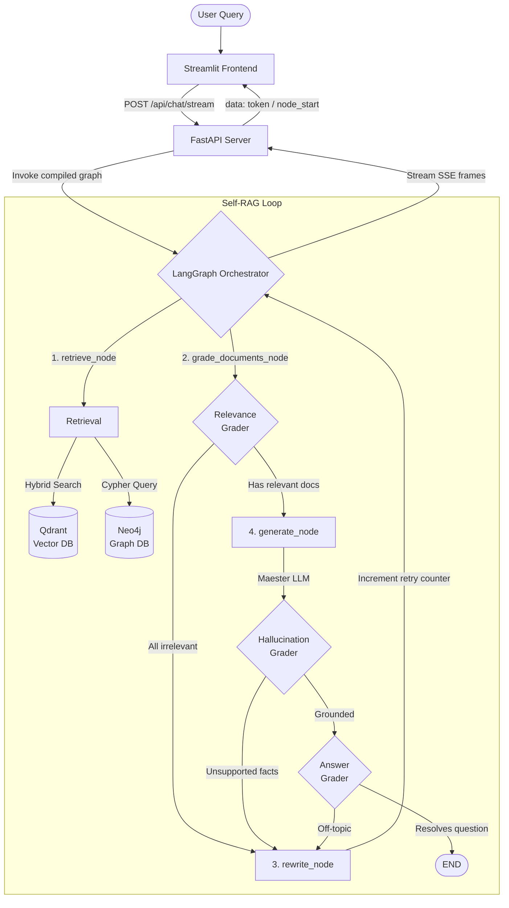

# 📜 Citadel Archival Search

### *Self-Corrective RAG for the A Song of Ice and Fire Universe*

[](https://www.python.org/)
[](https://fastapi.tiangolo.com/)
[](https://streamlit.io/)
[](https://github.com/langchain-ai/langgraph)
[](https://qdrant.tech/)
[](https://neo4j.com/)
[](https://github.com/features/actions)

An enterprise-grade **Self-Corrective Retrieval-Augmented Generation (Self-RAG)** system for querying the lore of Westeros. Rather than a static vector lookup, this application runs queries through a **cyclic agentic state machine** powered by LangGraph — dynamically retrieving, grading, rewriting, and generating until it produces a factually grounded, source-cited answer.

---

## ✨ What Makes This Different

Most RAG systems retrieve documents and generate an answer — done. This system doesn't stop there.

| Capability | Standard RAG | Citadel Self-RAG |
|---|---|---|
| Document Retrieval | ✅ Vector similarity | ✅ Hybrid (dense + sparse) + Graph |
| Relevance Filtering | ❌ | ✅ LLM-graded per document |
| Hallucination Detection | ❌ | ✅ Grounding check post-generation |
| Query Optimization | ❌ | ✅ Automatic rewrite + retry (up to 3×) |
| Answer Validation | ❌ | ✅ Checks if answer addresses the question |
| Session Memory | ❌ | ✅ Thread-isolated via LangGraph checkpointer |
| Evaluation Suite | ❌ | ✅ RAGAS + LangSmith golden dataset |

---

## 🏛️ Architecture

The core is a **cyclic LangGraph state machine** with four nodes. Conditional routing edges decide whether to generate, rewrite, or terminate based on structured quality checks.



### Key Design Decisions

- **`MemorySaver` checkpointer** — Used instead of `SqliteSaver` to ensure native async compatibility with LangGraph and zero file-dependency overhead on cloud deployments.
- **Concurrent document grading** — `grade_documents_node` fans out to an `asyncio.gather` call, grading all retrieved documents in parallel rather than serially.
- **Max retry circuit breaker** — `search_retry_count` in `AgentState` caps the rewrite-retrieve loop at **3 iterations**, preventing infinite loops on unanswerable queries.
- **Decoupled services** — Frontend (Streamlit) and backend (FastAPI) are fully independent containers, communicating exclusively over HTTP SSE.

---

## 🛠️ Tech Stack

| Layer | Technology | Purpose |
|---|---|---|
| **Orchestration** | LangGraph + LangChain | Cyclic agent state machine |
| **LLM Inference** | Groq (`llama-3-70b`, `llama-3-8b`) | Generation, grading, rewriting |
| **Vector DB** | Qdrant | Hybrid dense+sparse search |
| **Embeddings** | FastEmbed (BGE-Small-En + SPLADE) | Local ONNX — no API call needed |
| **Graph DB** | Neo4j | Character lineage & house relationships |
| **API Server** | FastAPI + Uvicorn | Async SSE streaming backend |
| **UI Client** | Streamlit | Chat interface with live agent logs |
| **Observability** | LangSmith | Agent trace monitoring & latency metrics |
| **Evaluation** | RAGAS + LangSmith Datasets | Offline faithfulness / relevancy scoring |
| **Containerization** | Docker + Docker Compose | Full-stack local or cloud deployment |
| **CI** | GitHub Actions | Automated pytest on push/PR |

---

## 📁 Project Structure

```
citadel-archival-search/
├── backend/
│   ├── app/
│   │   ├── api/            # FastAPI route handlers (SSE streaming)
│   │   ├── core/           # Settings (pydantic-settings), config loader
│   │   ├── graph/
│   │   │   ├── state.py    # AgentState TypedDict
│   │   │   ├── nodes.py    # retrieve, grade, generate, rewrite nodes
│   │   │   ├── chains.py   # LLM chains (grader, generator, rewriter)
│   │   │   └── workflow.py # StateGraph construction & compilation
│   │   ├── services/
│   │   │   ├── ingestion.py    # ETL: epub → chunks → embeddings → DBs
│   │   │   ├── retrieval.py    # Hybrid Qdrant + Neo4j retrieval
│   │   │   ├── qdrant_service.py
│   │   │   └── neo4j_service.py
│   │   └── main.py         # FastAPI app entrypoint
│   ├── scripts/
│   │   ├── run_ingestion.py        # Full ETL pipeline runner
│   │   ├── run_missing_ingestion.py # Incremental ingestion for missing chunks
│   │   └── seed_neo4j_only.py      # Seeds only the graph DB
│   └── Dockerfile
├── frontend/
│   ├── app.py              # Streamlit UI with SSE consumer + agent log panel
│   └── Dockerfile
├── evals/
│   ├── golden_dataset.json      # 30 curated ASOIAF Q&A pairs (factual, lineage, thematic)
│   ├── run_ragas.py             # Offline RAGAS evaluation runner
│   ├── push_to_langsmith.py     # Pushes golden dataset to LangSmith
│   ├── conftest_evals.py        # Eval bootstrap (env, sys.path setup)
│   └── results/                 # Timestamped RAGAS result JSON files
├── tests/
│   ├── conftest.py
│   ├── test_api.py
│   ├── test_graph.py
│   └── test_ingestion.py
├── data/                    # Source epub/text files & conversion scripts
├── .github/workflows/ci.yml # GitHub Actions CI pipeline
├── docker-compose.yml       # Full-stack orchestration (5 services)
├── requirements.txt
└── .env.example
```

---

## 🚀 Getting Started

### Prerequisites

- **Python 3.11+**
- **Docker & Docker Compose** (for database services)
- **Groq API Key** — [get one free](https://console.groq.com/)
- **LangSmith API Key** *(optional, for tracing)* — [langsmith.com](https://www.langsmith.com/)

### 1. Clone & Configure

```bash
git clone https://github.com/your-username/citadel-archival-search.git
cd citadel-archival-search
cp .env.example .env
```

Fill in your credentials in `.env`:

```env
PROJECT_NAME="ASOIAF Self-Corrective RAG"

# LLM
GROQ_API_KEY=your_groq_api_key_here

# Vector Database
QDRANT_URL=http://localhost:6333
QDRANT_API_KEY=your_qdrant_api_key_here

# Graph Database
NEO4J_URI=bolt://localhost:7687
NEO4J_USERNAME=neo4j
NEO4J_PASSWORD=your_neo4j_password_here

# LangSmith Tracing (optional)
LANGCHAIN_TRACING_V2=false
LANGCHAIN_API_KEY=your_langchain_api_key_here
LANGSMITH_PROJECT=citadel-archival-search-evals
```

---

### Option A — Docker Compose (Recommended)

This spins up all 5 services in the correct dependency order: Qdrant → Neo4j → Ingestion → Backend → Frontend.

```bash
docker compose up --build
```

Once the ingestion container exits successfully, the backend and frontend will be live:

| Service | URL |
|---|---|
| Streamlit UI | http://localhost:8501 |
| FastAPI Backend | http://localhost:8000 |
| Qdrant Dashboard | http://localhost:6333/dashboard |
| Neo4j Browser | http://localhost:7474 |

---

### Option B — Manual Setup (Step-by-Step)

#### Step 1 — Start Database Containers

```bash
docker compose up qdrant neo4j -d
```

#### Step 2 — Python Environment

```bash
python -m venv venv

# Windows
venv\Scripts\activate

# macOS / Linux
source venv/bin/activate

pip install -r requirements.txt
```

#### Step 3 — Ingest Data

Run the ETL pipeline to parse source files, generate hybrid embeddings, and seed both databases:

```bash
python backend/scripts/run_ingestion.py
```

> If ingestion was partially completed, use `run_missing_ingestion.py` to backfill gaps without re-processing existing chunks.

#### Step 4 — Start the Backend

```bash
python -m uvicorn backend.app.main:app --host 127.0.0.1 --port 8000 --reload
```

#### Step 5 — Start the Frontend

In a new terminal (with the venv activated):

```bash
python -m streamlit run frontend/app.py
```

Open **http://localhost:8501** and start querying the archives.

---

## 🧪 Testing

The test suite covers the API endpoints, the full LangGraph workflow, and the ingestion pipeline.

```bash
# Run full test suite
python -m pytest -v tests/

# Run a specific module
python -m pytest tests/test_graph.py -v
```

CI runs automatically on every push and pull request to `main` via GitHub Actions.

---

## 📊 Evaluation

The `evals/` directory contains a complete offline evaluation framework built on [RAGAS](https://docs.ragas.io/).

### Golden Dataset

`evals/golden_dataset.json` — 30 curated ASOIAF question-answer pairs across three categories:

| Category | Count | Description |
|---|---|---|
| `factual` | ~12 | Direct lore facts (sigils, swords, events) |
| `lineage` | ~10 | Character relationships & genealogy (requires Neo4j) |
| `thematic` | ~8 | Open-ended questions on themes & motifs |

### Running RAGAS Evals

```bash
# Full eval (all 30 examples, requires live Qdrant + Neo4j)
python evals/run_ragas.py

# Quick smoke test — 5 examples
python evals/run_ragas.py --sample 5

# Filter by category
python evals/run_ragas.py --categories factual lineage

# Skip graph-requiring examples (no Neo4j needed)
python evals/run_ragas.py --skip-graph

# Tag the result file
python evals/run_ragas.py --tag v2_hybrid
```

Results are saved as timestamped JSON files to `evals/results/`. Metrics include:

- **Faithfulness** — Is the answer grounded in the retrieved context?
- **Answer Relevancy** — Does the answer address the question?
- **Context Precision** — Are the retrieved chunks actually relevant?
- **Context Recall** — Does the retrieved context cover the ground truth?

### LangSmith Integration

Push the golden dataset to LangSmith for online experiment tracking:

```bash
python evals/push_to_langsmith.py
```

---

## 🔌 API Reference

The FastAPI backend exposes a single streaming endpoint:

### `POST /api/chat/stream`

**Request Body:**
```json
{
  "message": "Who are the children of Rhaenyra Targaryen?",
  "thread_id": "550e8400-e29b-41d4-a716-446655440000"
}
```

**Response:** Server-Sent Events (SSE) stream of JSON frames:

| `event` | `data` | Description |
|---|---|---|
| `node_start` | `"retrieve"` / `"grade_documents"` / `"generate"` / `"rewrite"` | Agent entered a new node |
| `node_end` | `"grade_documents"` | Node finished execution |
| `token` | `"...text chunk..."` | Streaming LLM output token |
| `error` | `"...error message..."` | Unrecoverable graph error |

The `thread_id` enables conversation memory — the LangGraph `MemorySaver` checkpointer uses it to restore prior state, enabling multi-turn dialogue.

---

## 🤝 Contributing

1. Fork the repository
2. Create a feature branch: `git checkout -b feature/your-feature`
3. Make your changes and ensure `pytest` passes
4. Open a pull request — CI will run automatically

---

## 📜 License

This project is for educational and research purposes. *A Song of Ice and Fire* is the intellectual property of George R. R. Martin.
